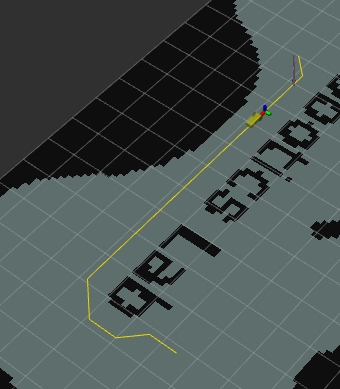

# ZJU-ROBOTICSII

```cpp
source devel/setup.bash
roslaunch course_agv_nav nav.launch
```

some code, just for simulation.

star this repo if you like it or can help you.

## Path Planning

A*, i'm too lazy to code JPS again in python/cpp since A* can find correct path in 0.1~0.2s, which is quite enough for my simulation. if you want to get faster, maybe you can try to code a JPS/JPS+ in cpp.



## Trajectory Planning 

DWA, since we have to limit our speed in 0.2m/s, it seems to be a waste of time to adjust parameters for a long time...

TIPS: be sure that you had install GPU driver or maybe you can't get laser message. as a result, the car can't avoid obstacles.

## Odometry

ICP, TA requires to finish in python. 

```cpp
source devel/setup.bash
roslaunch course_agv_icp icp.launch
(a new terminal) rosbag play (001/002/003).bag
```

### My Work
- cKDTree being used to boost
- linear interpolation being used to fill nan data
- fit two straight lines to multiple points, and then calculate the sine of the straight line angle, so as to find the corner points to reduce the calculation time
- (the work effect is not good) Match the current data with multi-frame lidar data to increase the amount of data, thereby improving accuracy

## Localization

EKF
